## 计算机毕业设计Python+大模型新闻自动分类 新闻舆情预测 新闻语料情感分析 新闻推荐系统 朴素贝叶斯分类算法 机器学习 深度学习

## 要求
### 源码有偿！一套(论文 PPT 源码+sql脚本+教程)

### 
### 加好友前帮忙start一下，并备注github有偿纯python新闻分类
### 我的QQ号是2827724252或者798059319或者 1679232425 或者 微信:bysj1688

# 

### 加qq好友说明（被部分 网友整得心力交瘁）：
    1.加好友务必按照格式备注
    2.避免浪费各自的时间！
    3.当“客服”不容易，repo 主是体面人，不爆粗，性格好，文明人。

## 介绍
 利用网络爬虫技术从某新闻网站爬取最新的新闻数据，并进行版块分类，对某篇版块下的所有新闻进行中文分词，保留表征能力强名词和动词作为关键词，并进行关键词词频统计，同时对新闻进行词云统计和词群分析。对不同版块的新闻热度进行统计分析。利用 flask 搭建后台，构建标准的 restful 接口，前端利用 bootstrap + echarts + jquery 调用后台接口，并进行前端的渲染可视化。
更新日志2024-11-03：优化网络爬虫、前端页面和交互逻辑，增加话题趋势预测算法。

## 演示视频
https://www.bilibili.com/video/BV1EHSCYHEZi
## 演示截图

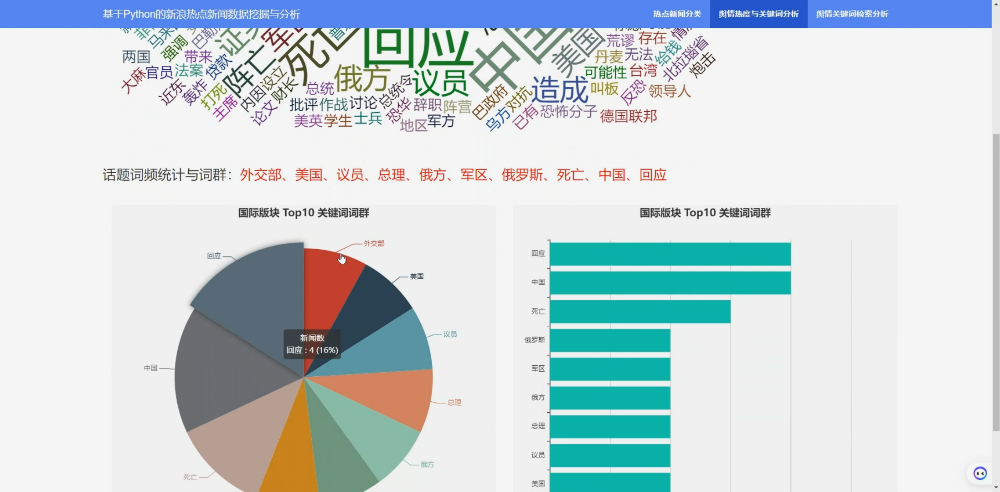
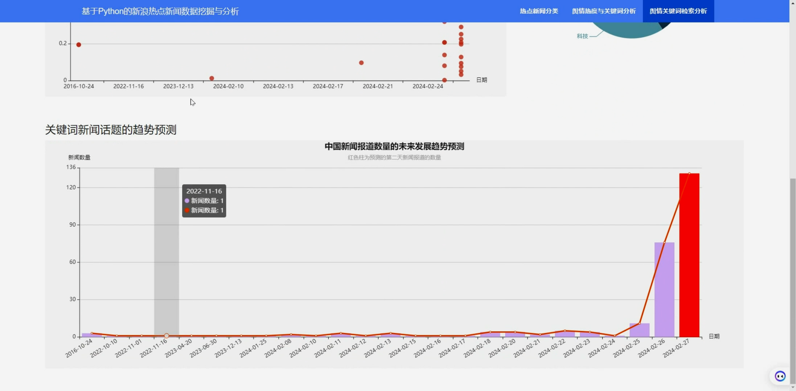
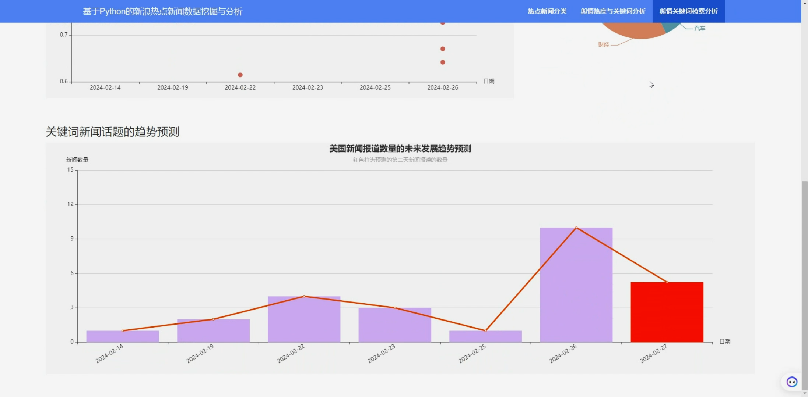
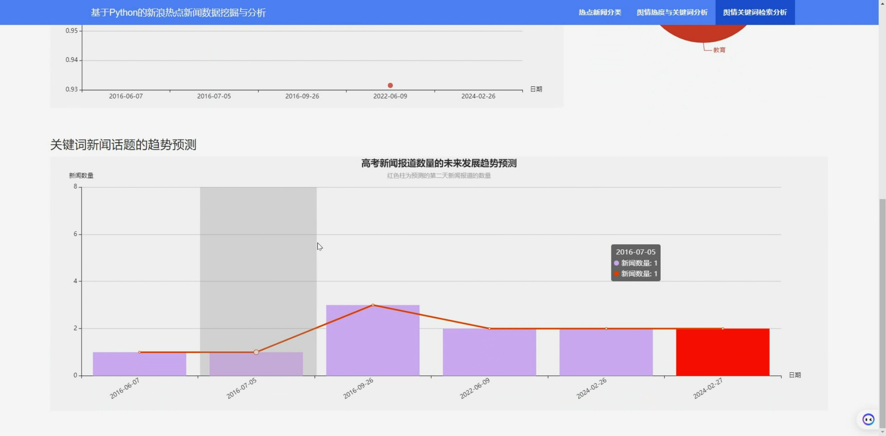
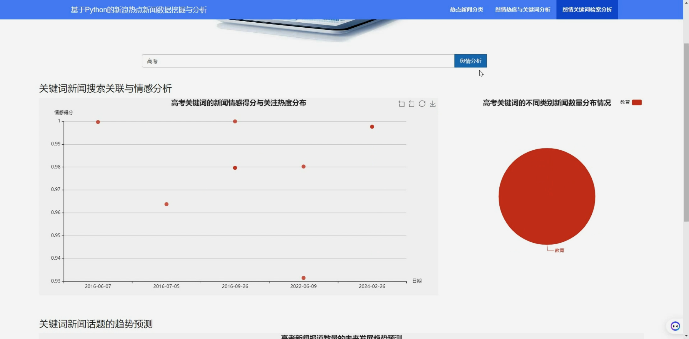
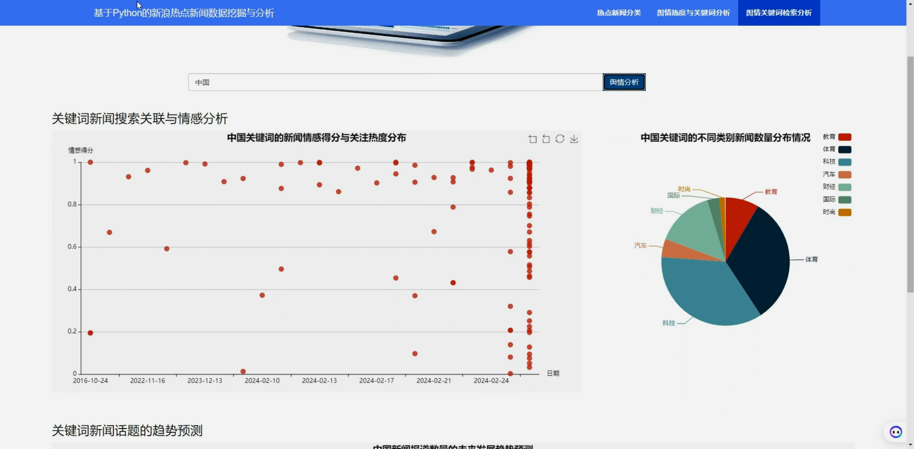
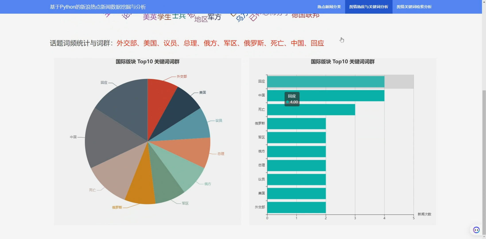
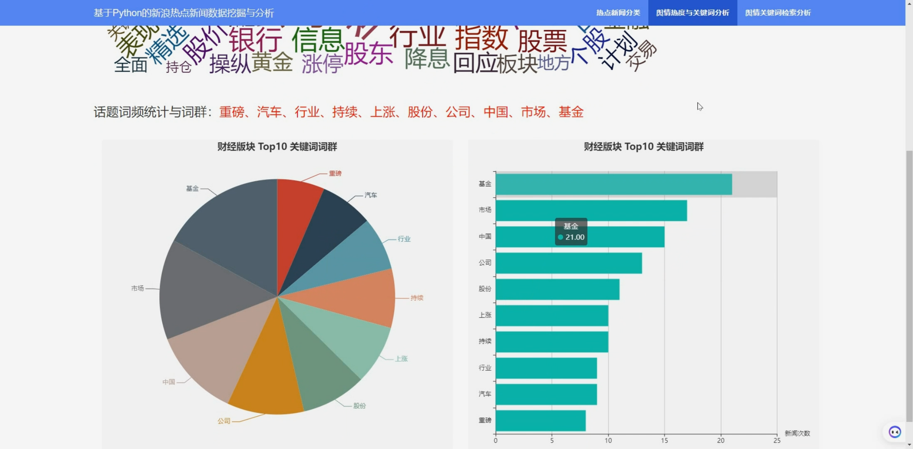
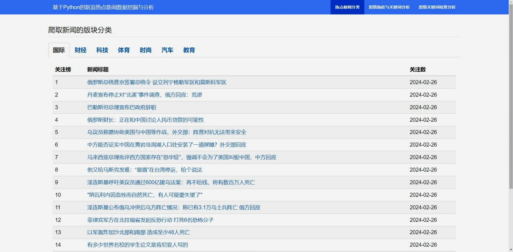
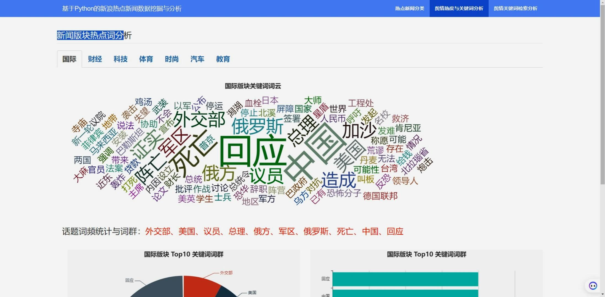
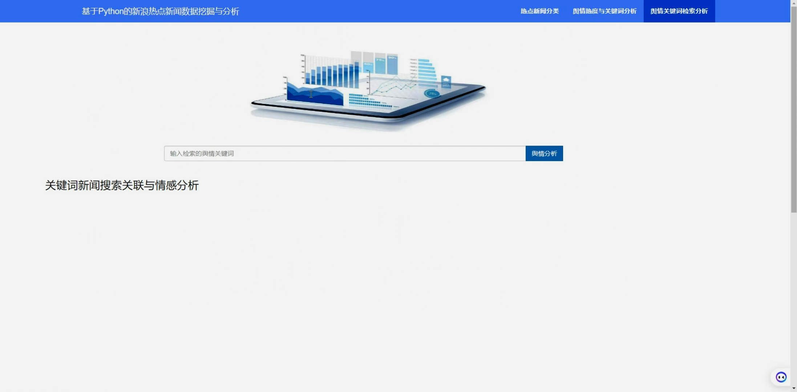

